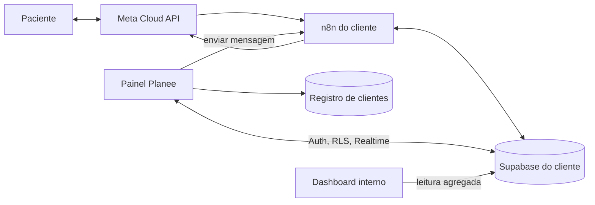
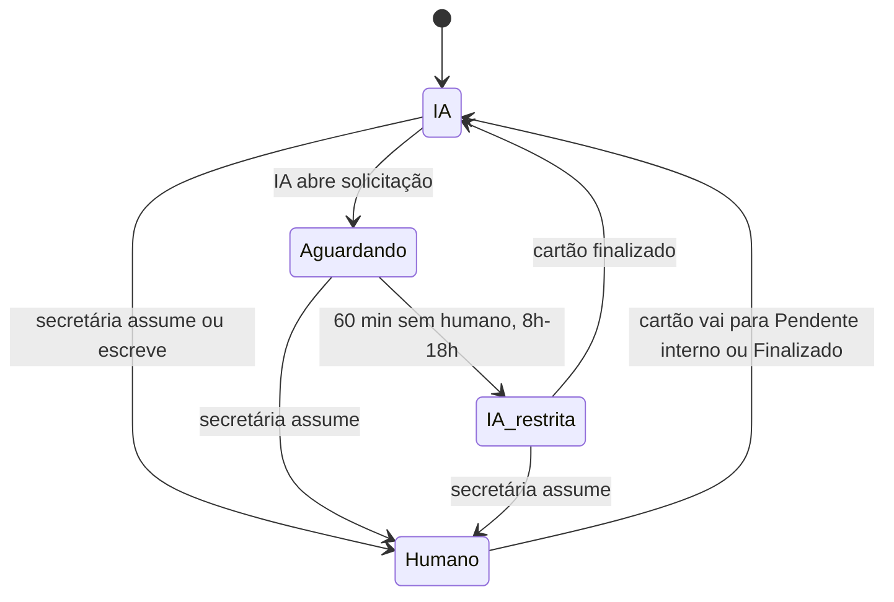
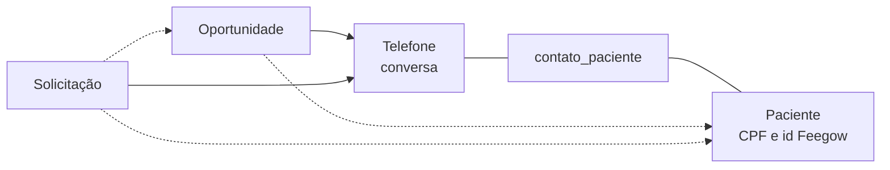

# Painel Planee — especificação do produto

Sep 17, 2026 · @Planee Lab IA

## 1. Visão e princípios

O Painel Planee é a tela única onde a clínica atende e a Planee opera: espelho do WhatsApp, CRM, configuração do agente e indicadores, todos lendo o mesmo banco que a automação já usa. "Painel Planee" é nome provisório.

Três decisões já tomadas sustentam o desenho:

| Decisão | Consequência |
| --- | --- |
| App próprio sobre Supabase | Nenhuma cópia de dados. Painel e n8n leem e escrevem nas mesmas tabelas. |
| Secretária atende só pelo espelho | "Lido", "não lido" e "finalizado" passam a ser campos nossos, não do app do WhatsApp. |
| Multi-cliente desde o início | Um app só. Cada cliente continua com o seu Supabase, como já é hoje no n8n. |

Princípios que valem para todos os módulos:

- **Estado explícito, nunca inferido.** Quem é o dono da conversa (IA ou humano) e se o atendimento terminou são campos gravados por uma ação. Hoje isso é deduzido de um relógio de 7 minutos, e ninguém marca que finalizou.
- **O painel não fala com a Meta.** Todo envio passa por um webhook do n8n. O token fica em um lugar só e a mensagem da secretária entra no histórico como `[EQUIPE]`, igual a hoje.
- **O agente não depende do painel.** Se o painel cair, a IA continua atendendo. O painel só lê, e escreve em campos de estado bem delimitados.
- **Primeiro ler, depois escrever.** As primeiras entregas são somente leitura e não tocam na produção.

## 2. Perfis e acessos

São três papéis. A secretária atende, o gestor da clínica acompanha e ajusta regras de negócio, a Planee opera tudo.

| Módulo | Secretária | Gestor da clínica | Planee |
| --- | --- | --- | --- |
| Inbox (ler, assumir, responder, finalizar) | sim | sim | sim, com registro de acesso |
| Chamadas de ferramenta e raciocínio da IA na conversa | não | não | sim |
| CRM de contatos | sim | sim | sim |
| CPF completo | sim | sim | mascarado |
| Dashboard do cliente | não | sim | sim |
| Configuração: parâmetros de negócio | não | sim | sim |
| Configuração: prompt, modelo, guardrail | não | não | sim |
| Dashboard interno (custo, falhas, margem) | não | não | sim |
| Trocar de cliente | não | não | sim |

O custo do modelo nunca aparece para a clínica. O acesso da Planee a conversas de paciente fica registrado em `painel_auditoria`, porque são dados de saúde.

## 3. Arquitetura

Um app web único, um Supabase por cliente, e o n8n como único caminho de saída para o WhatsApp. Não existe banco central com dados de paciente.

O painel lê o banco do cliente direto do navegador, com Realtime. Para enviar mensagem, chama um webhook do n8n. O registro de clientes só guarda configuração.

| Peça | Escolha | Por quê |
| --- | --- | --- |
| Front | Next.js, um deploy, subdomínio por cliente (`neuroessentia.painel.planeelabia.com`) | O subdomínio decide em qual Supabase o app conecta. |
| Login | Supabase Auth do próprio cliente | Secretária pertence a uma clínica só. Evita emitir token entre bancos. |
| Permissão | RLS por papel, lido de `painel_usuarios` | Com um banco por cliente não precisa de coluna de tenant. |
| Tempo real | Supabase Realtime em `mensagens_gemini_cliente`, `conversas`, `atendimentos`, `notificacoes` | Mensagem nova aparece sem recarregar. |
| Registro de clientes | Tabela pequena num Supabase da Planee: subdomínio, URL, chave pública, webhook do n8n | É o único dado central. |
| Dashboard interno | Job diário que lê cada cliente com usuário somente leitura e grava agregados no Supabase da Planee | É o "caminho A" já validado para o Twenty. |
| Hospedagem | Fora da VPS do agente | O painel não disputa memória com o n8n em produção. |

A equipe da Planee tem um usuário em cada Supabase de cliente. Com três clientes isso é mais simples que um login federado; vale rever a partir de dez.

## 4. Inbox — o espelho do WhatsApp

A inbox mostra todas as conversas da linha da clínica e acrescenta o que o WhatsApp não tem: dono da conversa, não lido controlável e o botão Finalizar. Ela resolve os pedidos 1 e 3 da empresa contratada e o item 6 do backlog.

### Estados da conversa

O estado fica em `conversas.dono`. O agente consulta esse campo antes de responder, no lugar do bloqueio de 7 minutos no Redis. Em Aguardando e Humano a IA fica calada. O teto de 60 minutos em modo restrito é o já desenhado em `achado_retomada_handoff.md`: reconhece a demora, registra, não responde nada clínico.

O dono da conversa é derivado das solicitações abertas daquele telefone (seção 6): alguma Em atendimento, a conversa é Humano; nenhuma Em atendimento e alguma Aguardando equipe, é Aguardando; o resto é IA. Mover o cartão é o único gesto obrigatório da secretária.

Quando o cartão sai de Em atendimento, para Pendente interno ou Finalizado, a conversa volta para a IA. No assunto pendente ela continua calada, pela regra 14 que já existe, e responde todo o resto. Se a última mensagem for do paciente e estiver sem resposta, a IA é acionada na hora.

### Lido e não lido

São dois controles independentes, e nenhum depende do app do WhatsApp.

| Controle | Onde vive | Regra |
| --- | --- | --- |
| Não lido interno | `conversas.nao_lidas` e `conversas.marcada_nao_lida` | Conta mensagens do paciente desde a última abertura. Abrir a conversa zera. "Marcar como não lida" recoloca o marcador. É por clínica, não por usuária. |
| Visto azul para o paciente | Cloud API, `status: "read"` | Enviado quando a IA responde, ou quando a secretária abre uma conversa que está com ela. Pode ser desligado por cliente. |

A API da Meta não marca como não lida e a coexistência não sincroniza leitura (pesquisado em 14/09). Por isso o controle só existe de verdade se o atendimento for pelo painel.

### Filas

| Aba | Conteúdo | Ordenação |
| --- | --- | --- |
| Precisa de você | Aguardando, IA restrita, e Humano com mensagem não lida | Mais antiga esperando primeiro |
| Em atendimento | Humano, sem pendência | Última mensagem |
| IA atendendo | Dono IA | Última mensagem |
| Todas | Tudo, com busca por nome, telefone e texto | Última mensagem |

### Dentro da conversa

- Bolhas com autoria visível: paciente, IA, equipe (com o nome de quem enviou).
- Motivo da escalada fixado no topo, vindo do `notificar_equipe`.
- Áudio com player e transcrição; imagem e documento abertos do Storage.
- Status de entrega por mensagem: enviada, entregue, lida, falhou.
- Compositor com contagem da janela de 24h. Janela fechada: só aceita template aprovado.
- Respostas rápidas da clínica e nota interna, que não vai para o paciente nem para o contexto da IA.
- Painel lateral com a ficha do contato (seção 7).

A visão Planee mostra ainda chamadas de ferramenta, `[SEM_RESPOSTA]`, bloqueios do guardrail e o link para a execução no n8n.

## 5. Notificações

A notificação principal passa a ser dentro do painel, em tempo real; o WhatsApp da secretária vira reserva para quando o painel está fechado. Isso resolve a pendência "paciente chegou volta a ser imediato?": volta, no painel.

| Evento | Quem recebe | No painel | Reserva por WhatsApp |
| --- | --- | --- | --- |
| IA escalou (abre atendimento) | Secretária | Alerta sonoro, vai para Precisa de você | Resumo das 8h, 11h e 16h, só com o que ninguém abriu |
| Paciente chegou | Secretária | Alerta imediato, destaque | Imediato, se o painel estiver fechado |
| Paciente respondeu em conversa com humano | Secretária | Contador de não lidas | não |
| Atendimento aguardando há 30 min | Secretária | Destaque na fila | não |
| IA voltou em modo restrito (60 min) | Secretária e gestor | Marca na conversa | Entra no resumo |
| Janela de 24h fechando com atendimento aberto | Secretária | Aviso 2h antes | não |
| Agendamento com falha ou divergência | Secretária | Alerta na conversa | Como hoje |
| Feegow fora, workflow falhando, fallback ativo | Planee | Painel interno | WhatsApp do Mateus |
| Resumo do dia | Dr. Amilton | Dashboard | Relatório das 17h, mantido |

Notificação de navegador (Web Push) cobre a aba em segundo plano. A tabela `notificacoes` continua sendo o registro dos eventos e ganha `atendimento_id`. O que fecha uma pendência é `atendimentos.finalizado_em`; a coluna `resolved` deixa de ser usada em tela, porque significa "entrou no relatório".

## 6. CRM invisível — o que a automação usa

O CRM invisível já existe: são as tabelas que o n8n lê e escreve. O produto não cria um segundo CRM, ele dá tela a esse. A regra herdada do plano do ClickUp continua: o agente move tudo, o humano move no máximo uma coisa.

| Tabela | Papel | Quem escreve | Quem lê |
| --- | --- | --- | --- |
| `usuarios_cliente` | Um registro por telefone | n8n | n8n, painel |
| `pacientes` (nova) | Uma pessoa por CPF, com o id da Feegow | n8n e painel | n8n, painel |
| `contato_paciente` (nova) | Quais pacientes falam por qual telefone | n8n e painel | n8n, painel |
| `oportunidades` (nova) | Cartões do funil comercial | n8n | painel, dashboards |
| `atendimentos` (nova) | Cartões do funil de atendimento | n8n abre, painel move | n8n, painel, dashboards |
| `conversas` (nova) | Dono, não lidas, atribuição | n8n e painel | n8n, painel |
| `mensagens_gemini_cliente` | Histórico | só n8n | n8n, painel |
| `log_agendamentos` | Agendamentos feitos pela IA | n8n | painel, dashboards |
| `followup_log`, `followup_ensaio` | Decisões e envios de follow-up | n8n | painel, dashboards |
| `notificacoes` | Eventos para a equipe | n8n | painel |
| `contatos_equipe` (nova) | Números da equipe e o que cada um recebe | painel | n8n |
| `agentes_cliente`, `agente_parametros` (nova) | Prompt e parâmetros de negócio | painel | n8n |

### Dois funis, uma base

O CRM tem dois funis independentes: o comercial acompanha quem ainda vai virar consulta, o de atendimento acompanha o que a equipe precisa resolver. Os dois compartilham telefone e paciente, então a mesma pessoa aparece nos dois sem cadastro duplicado.

|  | Funil comercial | Funil de atendimento |
| --- | --- | --- |
| Cartão | Oportunidade: uma intenção de consulta | Solicitação: um pedido que precisa de humano |
| Tabela | `oportunidades` | `atendimentos` |
| Nasce quando | Chega mensagem de telefone sem oportunidade aberta | IA escala, Pix é recebido ou a equipe assume |
| Etapas | novo lead, contato realizado, interesse identificado, agendamento oferecido, follow up, agendamento confirmado ou perdido | aguardando equipe, em atendimento, pendente interno, finalizado |
| Quem move | A IA, sempre | A IA abre; a secretária move para pendente interno ou finalizado |
| Fecha com | `agendamento_id` da Feegow, ou motivo da perda | Quem finalizou e quando |
| Vários abertos no mesmo telefone | Sim, um por paciente | Sim, um por assunto |

Pendente interno é o que espera alguém de dentro, como o Dr. Amilton assinar um laudo ou uma receita. As etapas comerciais são as já definidas para o ClickUp, menos `aguardando equipe`, que passou para o outro funil.

No quadro de atendimento as colunas são os assuntos, não as etapas: Receita, Notas fiscais e documentos, Exames, Valores e pagamento, Agenda e encaixe, Outros. A lista é configurável por clínica. A etapa continua existindo e aparece como etiqueta no cartão. A IA escolhe o assunto ao abrir a solicitação, por um campo novo no `notificar_equipe`; a secretária pode trocar.

Cada cartão registra quatro marcas de tempo com responsável: quando foi aberto e por quem, quem viu e quando (uma linha por pessoa), quem assumiu e quando, quem finalizou e quando. Delas saem o tempo até alguém ver, até assumir e o tempo total, por assunto e por pessoa.

### Como os funis se ligam

Linha cheia é ligação obrigatória, pontilhada é preenchida quando se sabe.

- **Telefone** liga todo cartão à conversa. É a única chave que existe desde a primeira mensagem.
- **CPF** liga o cartão à pessoa. O cartão nasce sem paciente e ganha `paciente_id` quando a IA roda `buscar_paciente`, `criar_paciente` ou `salvar_cpf`, ou quando a secretária escolhe. Telefone com um paciente só: preenche sozinho.
- **Telefone não é pessoa.** `contato_paciente` permite vários pacientes num número e o mesmo paciente em dois números.
- **Solicitação aponta para a oportunidade** quando o pedido é comercial: desconto, valor de família, comprovante de Pix. O cartão comercial mostra que está esperando a equipe, e segue quando a solicitação é finalizada.
- **Busca por CPF ou telefone** devolve a pessoa com todos os cartões dos dois funis.

Contrato entre os dois lados:

- O painel nunca insere em `mensagens_gemini_cliente`. Mensagem da equipe entra pelo webhook do n8n.
- O painel altera estado por funções do banco (`assumir_conversa`, `finalizar_atendimento`, `marcar_nao_lida`), nunca por UPDATE solto. Cada função grava quem fez e quando.
- `contatos_equipe` substitui as 15 regras fixas do `Switch4` no buffer. Entrar ou sair alguém da equipe deixa de exigir edição de workflow.

## 7. CRM das secretárias

É a mesma base da seção 6, em três visões: os dois funis em kanban e a ficha da pessoa. A secretária não preenche o funil comercial; no de atendimento ela só move o cartão para Pendente interno ou Finalizado.

### Os dois kanbans

|  | Comercial | Atendimento |
| --- | --- | --- |
| Colunas | As sete etapas comerciais | Os assuntos: Receita, Notas fiscais e documentos, Exames, Valores e pagamento, Agenda e encaixe, Outros. Finalizados do dia aparecem por um botão |
| No cartão | Nome ou telefone, interesse, tempo na etapa, selo "esperando equipe" se houver solicitação ligada | Nome, motivo, etiqueta da etapa, aberto em (data, hora, por quem), responsável e quando assumiu, visto por (cada pessoa com data e hora), finalizado em, CPF, selo "lead" se houver oportunidade ligada |
| Clique | Abre a ficha, com a conversa a um clique | Abre a conversa |
| Arrastar | Não. Quem move é a IA | Entre assuntos, livre. A etapa muda pelos botões do cartão: Assumir, Pendente interno, Retomar, Finalizar |
| Ordenação | Mais tempo parado primeiro | Mais tempo esperando primeiro |

### Ficha do contato

| Bloco | Conteúdo | Fonte |
| --- | --- | --- |
| Identificação | Nome, telefone, CPF, link para o paciente na Feegow | `usuarios_cliente` |
| Pacientes deste telefone | Lista com CPF de cada um, porque telefone não é pessoa (mãe agenda para filho) | `contato_paciente` e pacientes |
| Próximo agendamento | Data, hora, profissional, tipo | Feegow, via tool `listar_agendamentos` |
| Histórico com a IA | Agendamentos criados, remarcados, falhas | `log_agendamentos` |
| Atendimentos | Cartões do funil de atendimento, abertos e finalizados: motivo, etapa, quem atendeu, quanto tempo levou | `atendimentos` |
| Funil e follow-up | Cartões do funil comercial deste telefone, com etapa, último follow-up e resultado | `conversas`, `followup_log` |
| Etiquetas e notas | Livres, da clínica | `contato_etiquetas`, `contato_notas` (novas) |
| IA neste contato | Liga e desliga a IA para este telefone | `conversas.ia_desligada` |

### Lista de contatos

Tabela com busca por nome, telefone ou CPF, e filtros por etapa de cada funil, etiqueta, profissional e "sem resposta há N dias". A busca por CPF encontra a pessoa mesmo que ela tenha trocado de número.

### Pendências

O kanban de atendimento é a tela de pendências. Os motivos são os sete já definidos: receita, desconto ou valor, laudo ou documento, encaixe, financeiro ou comprovante, pedido da paciente, outro. Substitui a leitura do relatório por horário.

## 8. Configurações do agente

A configuração tem três camadas, e é a camada de parâmetros que encurta o onboarding de cliente novo: o prompt vira molde, os valores vêm de tabela.

| Camada | Exemplos | Quem edita | Como entra em vigor |
| --- | --- | --- | --- |
| Parâmetros de negócio | Nome da agente, horário de atendimento, valores e modalidades, profissionais, frase de escalada, números da equipe, horários do resumo, follow-up ligado e cadência, limite de dias da agenda | Gestor e Planee | Salvar gera nova versão do prompt e recria o cache do Gemini |
| Prompt | Texto de `agentes_cliente` com variáveis `{{...}}` | Planee | Rascunho, comparação com a versão atual, publicar, reverter |
| Técnico | Modelo principal e fallback, limites do Context Limiter, guardrail, pausa geral da IA | Planee | Imediato, com registro |

Regras:

- Toda publicação grava uma linha em `agentes_cliente_versoes` com autor, data e texto completo. Reverter é publicar a versão anterior.
- Publicar chama o workflow de renovação de cache, porque mudar o prompt invalida o cache. A tela só mostra "publicado" depois de reler `cache_key` do banco.
- A pausa geral substitui os comandos `ativar_bot` e `pausar_bot` enviados por WhatsApp.
- Parâmetro que exige credencial (token da Feegow, token da Meta) não é editado no painel. O painel mostra só a validade: o token da Feegow vence em 14/12/2026.

A primeira versão desta tela é somente leitura para o gestor. A edição pelo gestor só abre depois que o prompt atual for convertido em molde, o que é trabalho de prompt, não de tela.

## 9. Dashboards

São duas telas sobre os mesmos dados: a do cliente mostra resultado, a interna mostra custo e saúde. Os indicadores saem de views `dash_*` em cada banco, consolidadas por dia numa tabela `dash_diario` via pg\_cron.

### Visão do cliente

| Indicador | Fonte | Pronto hoje? |
| --- | --- | --- |
| Consultas marcadas pela IA | `log_agendamentos`, `acao='criar'` com `agendamento_id` | sim |
| Remarcações e cancelamentos pela IA | `log_agendamentos` | sim |
| Conversas atendidas | telefones distintos em `log_requisicoes` | sim |
| Resolvidas sem humano | conversas sem `atendimentos` no período | depende de `atendimentos` |
| Tempo de resposta da equipe (mediana e p90) | `atendimentos` | depende de `atendimentos` |
| Pendências abertas e motivo | `atendimentos` | depende de `atendimentos` |
| Volume por hora e dia da semana | `mensagens_gemini_cliente` | sim, convertendo o `timestamp` TEXT |
| Follow-up: enviados, responderam, agendaram | `followup_log` cruzado com `log_agendamentos` | sim |
| Funil por estágio | `oportunidades.estagio` | depende de `oportunidades` |

Referência para a primeira conversa com a clínica: hoje a mediana de resposta da equipe é 2,7 min e o p90 é 7h30.

Com as marcas de tempo do cartão entram três indicadores de controle da equipe, todos por assunto e por responsável: tempo até o primeiro visto, tempo até assumir, e tempo total até finalizar. Fonte: `atendimentos` e `atendimento_vistas`.

### Visão interna da Planee

| Indicador | Fonte | Observação |
| --- | --- | --- |
| Custo do modelo em R$ por dia, conversa e modelo | `log_requisicoes`, `precos_modelo`, `cotacao_usd` | Preço por faixa de data, não `vigente_ate IS NULL`. Remover prefixo `models/`. |
| Custo de WhatsApp | `pricing_analytics` da Meta | Falta o CRON que grava |
| Margem por cliente | Valor do contrato menos custos | Contrato vem do registro de clientes |
| Uso de cache e de fallback | `log_requisicoes` | Teria mostrado os 5 dias em fallback de setembro |
| Falha de workflow e de ferramenta | `n8n_workflow_logs`, `log_agendamentos.erro` |  |
| Saúde da Feegow | `monitoramento_agente` | Depende do vigia, item 2 da fila |
| `[SEM_RESPOSTA]` e bloqueios do guardrail | `mensagens_gemini_cliente`, `log_eventos` |  |
| Validade de tokens e data da cotação | registro de clientes, `cotacao_usd` | Mostrar a data ao lado do valor |
| Todos os clientes lado a lado | agregados no Supabase da Planee | Exige as mesmas tabelas de log na SSA |

Não usar: `notificacoes.resolved` e `ms_gemini`, que está sempre nulo.

## 10. Modelo de dados

São treze tabelas novas e colunas opcionais em duas existentes. Nenhuma coluna existente muda de tipo ou de nome, então nenhum workflow quebra. Os nomes de coluna das tabelas atuais precisam ser conferidos no banco antes do SQL.

### Tabelas novas

| Tabela | Colunas principais |
| --- | --- |
| `pacientes` | `id`, `cpf` (único), `nome`, `feegow_paciente_id`, `criado_em` |
| `contato_paciente` | `telefone`, `paciente_id`, `vinculo` (titular, filho, cônjuge, outro), `principal` |
| `oportunidades` | `id`, `telefone`, `paciente_id` (opcional), `estagio`, `interesse` (tipo de consulta), `origem`, `agendamento_id`, `motivo_perda`, `aberta_em`, `estagio_desde`, `fechada_em` |
| `atendimentos` | `id`, `telefone`, `paciente_id` (opcional), `oportunidade_id` (opcional), `estagio` (aguardando\_equipe, em\_atendimento, pendente\_interno, finalizado), `motivo`, `origem` (ia\_escalou, pix, equipe\_assumiu), `resumo`, `aberto_em`, `assumido_em`, `assumido_por`, `primeira_resposta_em`, `pendente_desde`, `finalizado_em`, `finalizado_por`, `ia_restrita_em` |
| `conversas` | `telefone` (PK), `dono` (ia, aguardando, humano, ia\_restrita), `dono_desde`, `nao_lidas`, `marcada_nao_lida`, `ultima_lida_id`, `ultima_msg_id`, `ultima_msg_em`, `atribuida_a`, `ia_desligada` |
| `contatos_equipe` | `telefone`, `nome`, `papel`, `recebe` (lista de eventos), `ativo` |
| `agente_parametros` | `agente_id`, `chave`, `valor`, `atualizado_por`, `atualizado_em` |
| `agentes_cliente_versoes` | `id`, `agente_id`, `versao`, `prompt`, `parametros`, `publicado_por`, `publicado_em` |
| `painel_usuarios` | `user_id`, `nome`, `papel` (secretaria, gestor, planee), `ativo` |
| `painel_auditoria` | `id`, `user_id`, `acao`, `alvo`, `quando` |
| `contato_etiquetas`, `contato_notas` | `telefone`, `etiqueta` ou `texto`, `autor`, `quando` |

Para o controle de tempo e de responsáveis, `atendimentos` ganha `topico` (o assunto da coluna) e `aberto_por`, e entra a tabela `atendimento_vistas` com `atendimento_id`, `user_id` e `visto_em`. Ela recebe uma linha na primeira vez que cada pessoa abre o cartão ou a conversa daquela solicitação. A lista de assuntos fica em `agente_parametros`, chave `topicos_atendimento`.

Regras de integridade dos funis:

- No máximo uma oportunidade aberta por par telefone e paciente. Sem paciente identificado, uma por telefone.
- `conversas.dono` é recalculado por gatilho sempre que um atendimento muda de etapa. Ninguém grava `dono` direto.
- `pacientes` e `contato_paciente` nascem da carga de `usuarios_cliente` (CPF, nome e id Feegow que já existem lá). As colunas antigas ficam, para não quebrar as tools.
- CPF é guardado só em `pacientes`. Os cartões guardam `paciente_id`.

### Colunas novas em tabelas existentes

| Tabela | Coluna | Para quê |
| --- | --- | --- |
| `mensagens_gemini_cliente` | `criado_em timestamptz default now()` | Ordenar e agregar sem depender do `timestamp` TEXT |
| `mensagens_gemini_cliente` | `wamid` | Status de entrega, visto azul e reações (item 4 da fila) |
| `mensagens_gemini_cliente` | `status_entrega`, `midia_path`, `midia_tipo`, `enviado_por` | Espelho fiel: entrega, mídia original e nome de quem respondeu |
| `notificacoes` | `atendimento_id` | Ligar o evento à pendência |

### Manutenção automática

Um gatilho em `mensagens_gemini_cliente` atualiza `conversas` a cada inserção: `ultima_msg_id`, `ultima_msg_em` e, se a mensagem é do paciente, `nao_lidas + 1`. Assim a lista da inbox é uma leitura de uma tabela só, sem varrer as 37 mil mensagens.

A view `v_mensagens` entrega o histórico já classificado (paciente, IA, equipe, ferramenta) e esconde as linhas de ferramenta para quem não é Planee.

Carga inicial: uma linha em `conversas` por telefone de `usuarios_cliente`, todas com `dono = ia` e `nao_lidas = 0`.

## 11. O que muda no n8n

São nove alterações, e quatro tocam a cadeia principal do agente (buffer e agente). Todas seguem as regras de operação já documentadas: desativar e reativar após PATCH, e verificar relendo do banco.

| # | Workflow | Mudança | Risco |
| --- | --- | --- | --- |
| 1 | `1.[buffer]` | Gravar `wamid`, salvar mídia original no Storage, tratar o webhook de status de entrega | médio, é a porta de entrada |
| 2 | `1.[buffer]` | Trocar as regras fixas do `Switch4` por consulta a `contatos_equipe` | médio |
| 3 | `1.[buffer]` | Mensagem da equipe grava `conversas.dono = humano` no lugar dos dois relógios de 7 min | médio |
| 4 | `3.[agente]` | `verifica_intervensao_humana2` passa a ler `conversas.dono` no Postgres | médio |
| 5 | `notificar_equipe` | Abre `atendimentos`, grava `dono = aguardando`, e devolve erro de verdade quando descarta a chamada | baixo |
| 6 | novo `painel_enviar` | Webhook autenticado: valida janela de 24h, envia pela Meta, grava a mensagem `[EQUIPE]` com `enviado_por` | baixo, é novo |
| 7 | novo `painel_retomar` | Chamado por `finalizar_atendimento` e pelo teto de 60 min; entrega `server_url`, `telefone`, `apikey` ao `2.[Orquestrador]` | baixo, caminho já validado |
| 8 | Relatórios 8h, 11h, 16h e 17h | Passam a ler `atendimentos` abertos e não vistos | baixo |

A nona alteração é o funil comercial: as tools que já existem passam a mover a oportunidade. O buffer cria o cartão em novo lead, `verificar_disponibilidade` leva a agendamento oferecido, `criar_agendamento` fecha como confirmado com o `agendamento_id`, o follow-up marca follow up e, sem resposta, perdido. `buscar_paciente`, `criar_paciente` e `salvar_cpf` gravam `paciente_id` nos cartões abertos daquele telefone. Risco baixo: são gravações a mais, em tabela nova.

O caminho de coexistência continua ligado: se a secretária responder pelo celular, a mensagem entra como hoje e a conversa vai para Humano. O painel não depende disso, mas também não quebra.

Pré-requisito que vale a pena fazer antes: mover o token da Meta dos 26 nós para uma credencial do n8n. Os dois webhooks novos já nascem usando a credencial.

## 12. Fases de entrega

A ordem vai do que não toca a produção para o que toca. A secretária só migra na fase 2.

| Fase | Entrega | Toca o agente? | Critério de saída |
| --- | --- | --- | --- |
| 0. Fundação | Tabelas novas, gatilho de `conversas`, views, RLS, login, registro de clientes | não | Planee loga e vê a lista de conversas real |
| 1. Leitura | Inbox somente leitura em tempo real, dashboard do cliente e interno com o que já existe | não | Dr. Amilton abre o dashboard; Planee acompanha conversas sem abrir o Supabase |
| 2. Atendimento | Estados, Assumir, Finalizar, envio pelo painel, não lido, notificações, mudanças 1 a 8 do n8n | sim | Amanda atende um dia inteiro só pelo painel; teto de 60 min testado no número do Mateus |
| 3. CRM | Os dois funis em kanban, ficha, lista, etiquetas, notas, pacientes por telefone | não | Relatório por horário vira reserva |
| 4. Configuração | Versões de prompt e publicação com cache; depois parâmetros de negócio | sim, na publicação | Uma troca de valor feita pelo painel chega ao agente e é revertida |
| 5. Segundo cliente | SSA no mesmo app, dashboard lado a lado | não | Onboarding medido em horas |

A fase 1 já entrega valor de contrato: "a IA marcou N consultas" numa tela que o cliente abre sozinho.

## 13. Riscos e decisões em aberto

O maior risco não é técnico: é a secretária continuar no celular. Se isso acontecer, o não lido e o Finalizar voltam a mentir, como o `notificacoes.resolved` hoje.

| Risco | Tratamento |
| --- | --- |
| Adoção pela secretária | Painel precisa ser mais rápido que o celular: alerta sonoro, respostas rápidas, ficha ao lado. O teto de 60 min cobre o esquecimento. |
| Dados de saúde (LGPD) | Um banco por clínica, RLS por papel, CPF mascarado para a Planee, registro de acesso, mídia em bucket privado com URL assinada. |
| Mídia original não é guardada hoje | Sem histórico de mídia para o passado; o espelho fica completo a partir da fase 2. |
| Coexistência exige abrir o app do WhatsApp Business de tempos em tempos | A confirmar na documentação da Meta antes de a Amanda largar o celular. |
| Mexer no buffer, que tem 139 nós e resíduo de migrações | Mudanças 1 a 3 entram uma por vez, cada uma verificada no banco antes da próxima. |
| Painel fora do ar | A IA segue atendendo. A equipe responde pelo celular, via coexistência. |

### A decidir

- [ ] Este produto encerra a dúvida ClickUp × Twenty × Chatwoot para atendimento? Proposta: sim. A lista do ClickUp fica sem uso e o Twenty segue só como CRM comercial da Planee.
- [ ] RLS está ligado e o PostgREST exposto no Supabase do Dr. Amilton? Só o console responde (Settings, API).
- [ ] Quais colunas `mensagens_gemini_cliente` e `usuarios_cliente` têm hoje. Necessário antes de escrever o SQL da fase 0.
- [ ] O banco da SSA tem as mesmas tabelas de log? Define o esforço da fase 5.
- [ ] Visto azul: enviar ao paciente quando a IA responde, ou só quando um humano abre?
- [ ] Nome do produto e domínio.

## 14. Decisões de 24/09: tela, CRM configurável e sistema visual

**O painel é a tela da secretária; o ClickUp sai do plano de atendimento.** O painel usa as tabelas que já existem no schema `teste` (`conversa_estado`, `crm_eventos`, `crm_fatos`, `pacientes`, `pacientes_telefone`) e o robô do CRM. Os nomes dessas tabelas substituem os propostos nas seções 6 e 10 onde coincidem.

**O CRM é configurável por projeto.** Cada cliente tem no seu banco:

| Tabela | Colunas | Quem edita |
| --- | --- | --- |
| `crm_etapas` | `id`, `ordem`, `nome`, `tipo` (aberta, ganho, perdido), `gatilho` | gestor e Planee |
| `crm_topicos` | `id`, `ordem`, `nome`, `icone`, `palavras` | gestor e Planee |
| `crm_config` | nomes exibidos das quatro etapas de atendimento, campos visíveis no cartão, modelo de partida | gestor e Planee |

Regras: o funil precisa de ao menos uma etapa de cada tipo; remover etapa ou assunto move os cartões para outra do mesmo tipo ou para o último assunto; as quatro etapas de atendimento são do sistema (decidem quando a IA se cala), podem ser renomeadas e não removidas. Três modelos de partida: Clínica, Assistência técnica (SSA), Contabilidade (Alfa). O robô do CRM e o `notificar_equipe` passam a ler gatilhos e palavras dessas tabelas, em vez de regras fixas no código.

**Sistema visual.** Cor só para estado; interface em neutros com ação primária em preto (claro) ou branco (escuro). Assuntos e etapas do funil não têm cor, têm ícone e nome, para que qualquer projeto os configure sem quebrar a leitura.

| Estado | Claro | Escuro | Ícone |
| --- | --- | --- | --- |
| IA atendendo | `#0f9a7a` | `#1b9676` | brilho |
| Aguardando equipe | `#d18f00` | `#b98300` | ampulheta |
| Com a equipe / em atendimento | `#1f5fbf` | `#2d8ae0` | pessoa |
| IA em modo restrito | `#d13438` | `#cf3d46` | alerta |
| Pendente interno | `#a35be6` | `#bb5fc9` | pausa |
| Finalizado | `#8a8880` | `#7d7c77` | check |

Validado com o verificador de paleta do dataviz, todos os pares entre si: visão normal ΔE ≥ 18,9 (claro) e 16,4 (escuro); daltonismo 7,3 e 6,2, na faixa que exige codificação secundária. Por isso todo estado aparece sempre com ícone e nome, nunca só a cor. Texto das pílulas com contraste ≥ 5,9:1 nos dois temas. Fonte Geist; Geist Mono para telefone, CPF e horário.
