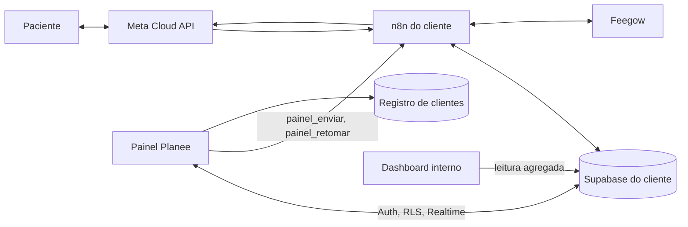
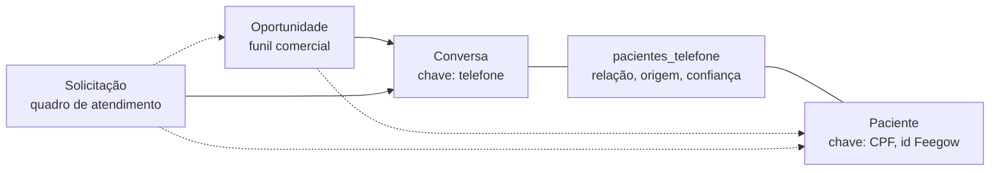
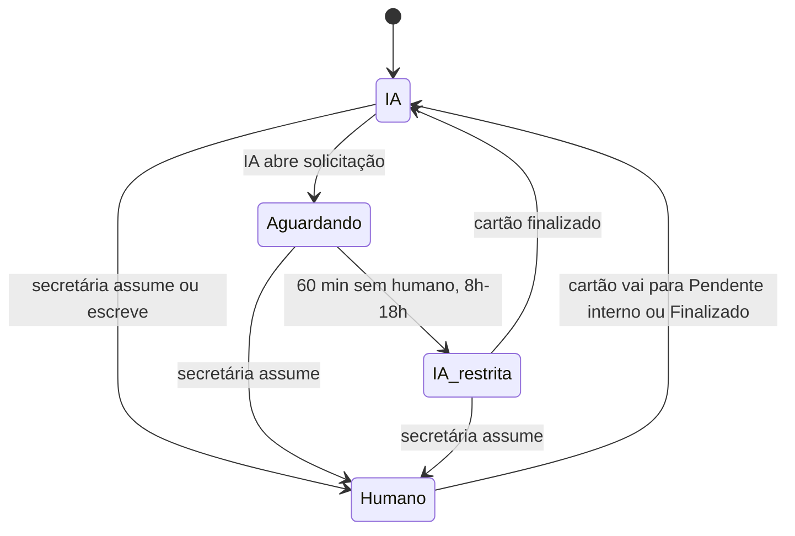

# Painel Planee — relatório completo da solução

Sep 24, 2026 · @Planee Lab IA

## 1. Como ler este relatório

Este relatório descreve o Painel Planee, o produto de gestão conjunta entre a Planee Lab IA e as clínicas que usam seu agente de WhatsApp. Foi escrito para outra IA assumir o contexto sem ler as 34 notas do projeto, e por isso é longo e usa os nomes reais de tabelas, workflows e ids.

Três graus de certeza aparecem no texto, e importa distingui-los:

| Marca | Significa |
| --- | --- |
| **Decidido** | O Mateus (Planee) escolheu, com data. Não reabrir sem ele. |
| **Proposto** | Desenho feito por Claude a partir das decisões; aceito por ausência de objeção, não por aprovação explícita. |
| **Medido** | Número lido do banco ou dos workflows, com data. |

O desenho do painel foi feito em 17/09/2026. Entre 20 e 24/09 o projeto avançou por outro caminho em parte do escopo (CRM no ClickUp e robô de classificação no banco de teste). A seção 13 trata dessa divergência; ela é a decisão mais importante em aberto.

Fontes primárias: a [especificação do produto](https://claude.ai/code/artifact/779f0772-e163-4d93-a9f1-13947d289a69) (13 seções, 17/09), o [protótipo navegável](https://claude.ai/artifact/Vv2pi7RCzo3L5QY8wp4REQ) e as notas do projeto listadas na seção 15. Tudo que está aqui foi lido delas; onde há número, há data.

## 2. Contexto

A Planee Lab IA (Balneário Camboriú, SC) vende agentes de recepção por WhatsApp como serviço gerido: taxa de implantação mais mensalidade, com a Planee configurando e mantendo tudo. O primeiro e principal cliente é o Instituto Neuro Essentia, clínica de neurologia do Dr. Amilton Silva Jr. Os outros dois são a SSA Soluções (agente com Trello, em outro n8n e outro banco) e a Contabilidade Alfa (contrato fechado, nada construído).

### O agente em produção

O agente da clínica chama-se **Sara** desde 14/09/2026 (antes, Amanda; o nome foi trocado porque a secretária humana da clínica também se chama Amanda). Apresenta-se como secretária da clínica e o prompt proíbe dizer que é IA; a SOUKELL pede o contrário (decisão D1, em aberto).

| Peça | O que é | Medido |
| --- | --- | --- |
| Orquestração | n8n 2.15.0 auto-hospedado, `[URL do n8n — ver projeto Claude]`, VPS Hetzner, Docker Swarm, modo fila | 32 workflows, 22 ativos (08/09) |
| Cadeia principal | `1.[buffer]` (139 nós) → `2.[Orquestrador]` → `3.[agente]` → `4.[ToolsHub]` (13 tools) → `5.[Mensagem]` | ids na seção 15 |
| Modelo | Gemini 3.7 Flash via Vertex AI, cache de contexto renovado por CRON de hora em hora; fallback Google AI Studio; guardrail Flash Lite | R$ 10 a 16 por dia útil (01 a 07/09) |
| Banco | Supabase (Postgres), um por cliente; credencial n8n `contatoplaneelabIA \| DR.amilton` | `mensagens_gemini_cliente` 50.938 linhas (24/09), `usuarios_cliente` 2.756 |
| Cache e locks | Redis: debounce do buffer, lock de envio, bloqueio por intervenção humana (TTL 420 s) | 21 nós |
| WhatsApp | Meta Cloud API em coexistência com o app WhatsApp Business; Phone Number ID e WABA no projeto Claude, fora do repositório | 823 conversas em 8 dias, todas gratuitas |
| Gestão da clínica | Feegow (agenda e cadastro), token com validade de 90 dias, vence em 14/12/2026 | 9 endpoints usados |
| Prompt | `agentes_cliente` id 1, 74.975 caracteres (22/09); id 2 é o follow-up |  |

### Como a equipe humana entra hoje

A secretária responde pelo app do WhatsApp Business no celular. A mensagem dela chega pelo webhook de coexistência, o buffer reconhece o número numa lista fixa de 15 regras (`Switch4`) e grava no histórico com o prefixo `[EQUIPE]`. Ao mesmo tempo arma dois relógios de 7 minutos (Redis e `usuarios_cliente.block_expira_em`) durante os quais a IA fica calada. Passados os 7 minutos, a IA volta sozinha. Não existe registro de quem atendeu, se terminou, nem se o paciente foi respondido.

A IA avisa a equipe pela tool `notificar_equipe`, que grava em `notificacoes`; a Amanda recebe um resumo por WhatsApp às 8h, 11h e 16h e o Dr. Amilton um relatório às 17h. A coluna `notificacoes.resolved` significa "entrou no relatório", não "foi resolvido".

### Terceiros envolvidos

A clínica contratou a SOUKELL (Letícia e Keila) para redesenhar o atendimento. Entregaram em 21/09 uma Arquitetura v1.0 (40 seções) e Scripts v1.0 (23 cenários). A palavra final sobre roteiro é delas. Dois critérios de aprovação da seção 39 desse documento pedem transferência humana real e controle de propriedade da conversa, que é exatamente o que o painel entrega.

## 3. O problema

A clínica não tem como saber quem está com cada conversa, se o paciente foi respondido, nem quando o atendimento humano terminou. Tudo que a IA sabe sobre "a equipe entrou" é um relógio de 7 minutos.

### Os pedidos da clínica (empresa contratada, 14/09)

| # | Pedido | Situação em 24/09 |
| --- | --- | --- |
| 1 | Transferência para humano, com a conversa "não lida" no WhatsApp da Amanda até ela finalizar | Metade possível: falta ligar a escalada ao bloqueio; "não lida" é inviável na API da Meta |
| 2 | Relatório para a Amanda às 8h, 11h e 16h | Feito em 14/09 |
| 3 | Transferir para humano depois do Pix de R$ 200 | Mesma mecânica do 1 |
| 4 | Follow-up do lead que não fechou | Motor no ar desde 14/09 |
| 5 | A IA ter nome próprio | Sara, 14/09 |
| 6 | "Ela se perde muito, não vejo transferindo pra Amanda" | Causas medidas: tool `atualizar_status_agendamento` vazia, `notificar_equipe` devolvendo ok ao descartar, rota da Ariane desligada |
| 7 | Contrato de prestação de serviço | Com o Mateus |

### O que o WhatsApp não permite (pesquisado em 14/09)

A Cloud API marca mensagem como **lida** (`status: "read"`, até 30 dias, em cascata), mas não marca como **não lida**. A coexistência não sincroniza estado de leitura em nenhuma direção. Nenhum dos 32 workflows marca nada como lido hoje. Logo, controle de lido e não lido só existe se o atendimento acontecer numa tela nossa.

### O que os números dizem

- Mediana de resposta da equipe: 2,7 min. p75: 55,6 min. p90: 7h30 (1.589 respostas, 30 dias).
- Em pleno expediente, 21,6% dos pacientes esperam mais de 1 hora e 9,6% mais de 4 horas.
- 1.459 notificações "abertas" desde 07/07 só porque ninguém marca que resolveu.
- Nove dias (11 a 20/09) com o agendamento automático fora do ar sem ninguém saber: a Sara empurrou todo agendamento para a Amanda na mão. É a explicação mais provável para a queixa de que "a IA aumentou o trabalho".
- A IA marcou 15 consultas em 8 dias (01 a 08/09), todas conferidas na Feegow. A clínica não tem tela para ver isso.

### Para a Planee

Cada cliente novo exige reconfigurar workflows à mão. Custo do modelo, fallback ativo e falha de ferramenta só aparecem consultando o banco. A migração para o Gemini 3.7 ficou 5 dias rodando no fallback sem ninguém notar.

## 4. A solução em uma página

O Painel Planee é uma tela única onde a clínica atende e a Planee opera, lendo o mesmo banco que a automação já usa. Nome provisório.

### Módulos

| Módulo | O que faz | Para quem |
| --- | --- | --- |
| Inbox | Espelho do WhatsApp com dono da conversa, não lido controlável, envio pela secretária, nota interna | Secretária, gestor, Planee |
| CRM: funil comercial | Um cartão por oportunidade de consulta, movido só pela IA | Gestor, Planee |
| CRM: quadro de atendimento | Um cartão por solicitação que precisa de humano, colunas por assunto, com marcas de tempo e responsável | Secretária, gestor |
| CRM: ficha do contato | Pacientes do telefone, agendamentos, histórico dos dois funis, etiquetas, notas | Secretária |
| CRM invisível | As tabelas que a automação lê e escreve; o painel dá tela a elas, não cria um segundo CRM | n8n |
| Notificações | Em tempo real no painel; WhatsApp vira reserva | Secretária, gestor, Planee |
| Configuração do agente | Parâmetros de negócio, prompt com versões, técnico | Gestor (parâmetros), Planee (tudo) |
| Dashboard do cliente | Consultas marcadas pela IA, tempo de resposta da equipe, pendências | Gestor |
| Dashboard interno | Custo por cliente, cache, fallback, falhas, saúde da Feegow | Planee |

### Decisões de base (Decidido, 17/09)

1. **App próprio sobre Supabase.** Não Chatwoot, não Twenty, não ClickUp para o atendimento. Nenhuma cópia de dados.
2. **A secretária atende só pelo espelho.** "Lido", "não lido" e "finalizado" passam a ser campos nossos. A coexistência continua ligada como reserva.
3. **Multi-cliente desde o início.** Um app; cada cliente continua com o seu Supabase; o subdomínio decide o banco.
4. **Dois funis ligados por telefone e CPF.** Comercial (oportunidade) e atendimento (solicitação).
5. **A conversa volta para a IA quando o cartão sai de "em atendimento"**, para pendente interno ou finalizado.
6. **Colunas do quadro de atendimento são assuntos, não etapas.** A etapa vira etiqueta no cartão.
7. **O cartão registra aberto por, visto por, assumido por e finalizado por, com data e hora.**

### Princípios (Proposto)

- Estado explícito, nunca inferido: dono da conversa e fim do atendimento são campos gravados por uma ação.
- O painel não fala com a Meta. Todo envio passa por webhook do n8n.
- O agente não depende do painel. Painel fora do ar, a IA segue atendendo.
- Primeiro ler, depois escrever. As primeiras entregas não tocam a produção.
- O agente move tudo; o humano move no máximo uma coisa. Se a secretária precisar arrastar cartão a cada passo, ela não vai fazer, e o quadro passa a mentir como o `notificacoes.resolved` mente hoje.

## 5. Arquitetura e infraestrutura

Um app web único, um Supabase por cliente, e o n8n como único caminho de saída para o WhatsApp. Não existe banco central com dados de paciente.



| Peça | Escolha (Proposto) | Motivo |
| --- | --- | --- |
| Front | Next.js, um deploy, subdomínio por cliente (`neuroessentia.painel.planeelabia.com`) | O subdomínio decide em qual Supabase o app conecta |
| Login | Supabase Auth do próprio cliente | Secretária pertence a uma clínica só; evita token entre bancos |
| Permissão | RLS por papel, lido de `painel_usuarios` (secretaria, gestor, planee) | Um banco por cliente dispensa coluna de tenant |
| Tempo real | Supabase Realtime em `mensagens_gemini_cliente`, `conversas`, `atendimentos`, `notificacoes` | Mensagem nova aparece sem recarregar |
| Registro de clientes | Tabela pequena num Supabase da Planee: subdomínio, URL, chave pública, webhooks do n8n, valor do contrato, validade de tokens | Único dado central; nenhum dado de paciente |
| Dashboard interno | Job diário lê cada cliente com usuário somente leitura e grava agregados no Supabase da Planee | É o "caminho A" validado em 08/09 para o Twenty |
| Hospedagem | Fora da VPS do agente | O painel não disputa memória com o n8n em produção |
| Acesso Planee | Um usuário por Supabase de cliente; CPF mascarado; acesso a conversa registrado em `painel_auditoria` | São dados de saúde |

O que ainda depende do console do Supabase: URL do projeto, se RLS está ligado, se o PostgREST está exposto, e se dá para criar role somente leitura restrita às tabelas de log. O n8n conecta por Postgres direto, então nada disso pode ser inferido de fora.

### Perfis e acessos

| Módulo | Secretária | Gestor | Planee |
| --- | --- | --- | --- |
| Inbox | sim | sim | sim, com auditoria |
| Chamadas de ferramenta e raciocínio da IA na conversa | não | não | sim |
| CRM | sim | sim | sim |
| CPF completo | sim | sim | mascarado |
| Dashboard do cliente | não | sim | sim |
| Parâmetros de negócio | não | sim | sim |
| Prompt, modelo, guardrail | não | não | sim |
| Dashboard interno e troca de cliente | não | não | sim |

O custo do modelo nunca aparece para a clínica.

## 6. Modelo de domínio

Quatro entidades, ligadas por duas chaves. Telefone é a única chave que existe desde a primeira mensagem; CPF chega depois, quando a IA identifica a pessoa.



Linha cheia é ligação obrigatória; pontilhada é preenchida quando se sabe.

| Entidade | Cartão de | Nasce quando | Fecha com | Vários abertos no mesmo telefone |
| --- | --- | --- | --- | --- |
| Conversa | um telefone | primeira mensagem | nunca | não, é uma por telefone |
| Paciente | uma pessoa (CPF) | `buscar_paciente`, `criar_paciente`, `salvar_cpf`, ou a secretária vincula | nunca | não se aplica |
| Oportunidade | uma intenção de consulta | mensagem de telefone sem oportunidade aberta | `agendamento_id` da Feegow ou motivo da perda | sim, uma por paciente |
| Solicitação | um pedido que precisa de humano | IA escala (`notificar_equipe`), Pix recebido, ou equipe assume | quem finalizou e quando | sim, uma por assunto |

### Por que telefone não é pessoa (Medido, 24/09)

- 313 CPFs válidos no histórico; 53 telefones (17%) têm 2 ou mais CPFs; máximo 4. São famílias: mãe agenda para filho, gêmeos, casal.
- Cerca de 25% dos vínculos extraídos de imagens são ruído: CPF do médico na receita, chave Pix, número de CNH que passa no dígito verificador. Por isso um vínculo vindo do histórico só fica ativo depois de confirmado na Feegow.
- O mesmo número aparece com 11, 12 e 13 dígitos (com e sem o 9, com e sem o 55). A chave normalizada `public.tel_chave` = `55` + DDD + últimos 8 dígitos resolve; `@lid` e `lid_pending` viram NULL.
- O CPF do Dr. Amilton aparecia em 11 números, porque está nas receitas que os pacientes mandam. Números da equipe e seus CPFs ficam fora de tudo.

### Estados da conversa (dono)

`ia` → `aguardando` (IA abriu solicitação) → `humano` (alguém assumiu ou escreveu) → `ia` (cartão saiu de em atendimento). De `aguardando`, sem humano em 60 min entre 8h e 18h, vai para `ia_restrita`: a IA reconhece a demora, registra, escala, e não responde nada clínico. O dono é **derivado** das solicitações abertas do telefone, por gatilho; ninguém grava direto. Se há alguma em atendimento, é humano; senão, se há alguma aguardando, é aguardando; senão, é IA.

### Etapas

- Comercial: novo lead, contato realizado, interesse identificado, agendamento oferecido, follow up, agendamento confirmado, perdido. São as já definidas para a lista do ClickUp em 14/09, menos `aguardando equipe`, que é estado de atendimento.
- Atendimento: aguardando equipe, em atendimento, pendente interno (espera alguém de dentro, como o Dr. assinar um laudo), finalizado.
- Assuntos (colunas do quadro, configuráveis por clínica): Receita; Notas fiscais e documentos; Exames; Valores e pagamento; Agenda e encaixe; Outros. Os três primeiros vieram do Mateus; os outros acomodam os sete motivos já usados pelo `notificar_equipe` (receita, desconto/valor, laudo/documento, encaixe/horário, financeiro/comprovante, pedido da paciente, outro).

## 7. Módulo Inbox

A inbox mostra todas as conversas da linha da clínica e acrescenta o que o WhatsApp não tem: dono, não lido controlável e o gesto de mover o cartão. Resolve os pedidos 1 e 3 da clínica.

### Filas

| Aba | Conteúdo | Ordenação |
| --- | --- | --- |
| Precisa de você | dono aguardando ou ia\_restrita, e humano com não lida | mais antiga esperando primeiro |
| Com a equipe | dono humano, sem pendência | última mensagem |
| IA | dono ia | última mensagem |
| Todas | tudo, com busca por nome, telefone, texto e final de CPF | última mensagem |

### Lido e não lido

Dois controles independentes, nenhum depende do app do WhatsApp.

| Controle | Onde vive | Regra |
| --- | --- | --- |
| Não lido interno | `conversas.nao_lidas`, `conversas.marcada_nao_lida` | Conta mensagens do paciente desde a última abertura; abrir zera; "marcar como não lida" recoloca o marcador. É por clínica, não por usuária |
| Visto azul para o paciente | Cloud API, `status: "read"` | Enviado quando a IA responde ou quando um humano abre a conversa; desligável por cliente. Política em aberto |

### Dentro da conversa

- Bolhas com autoria: paciente, IA, equipe (com o nome de quem enviou), sistema. Para a Planee, também chamadas de ferramenta, `[SEM_RESPOSTA]`, bloqueios do guardrail e link para a execução no n8n.
- Faixa no topo com o estado e as solicitações abertas; em `ia` com pendente interno, diz em que assunto a IA está calada.
- Cabeçalho: Marcar como não lida; Assumir conversa (quando o dono não é humano); Pendente interno e Finalizar (quando é).
- Áudio com player e transcrição; imagem e documento abertos do Storage; status de entrega por mensagem.
- Compositor com contagem da janela de 24h; fechada, só aceita template aprovado. Enter envia e, se o dono não era humano, assume. Respostas rápidas da clínica. Nota interna: não vai para o paciente nem para o contexto da IA.
- Painel lateral: pacientes do telefone com CPF, próximo agendamento, cartões dos dois funis, atendimentos anteriores, etiquetas.

### Handoff e retomada



Quando a conversa volta para a IA e a última mensagem é do paciente sem resposta, o painel chama `painel_retomar`, que entrega `server_url`, `telefone` e `apikey` ao `2.[Orquestrador]`, o mesmo caminho já validado em 04/09 para o `handoff-resume`. No assunto pendente a IA continua calada pela Regra 14 do prompt, que já existe.

O teto de 60 minutos foi escolhido em 07/09 a partir da medição: 7 minutos serve para calar a IA enquanto o humano digita, mas é curto demais para decidir que o humano sumiu. Volume estimado: cerca de 9 retomadas por dia.

## 8. Módulo CRM

Dois quadros em kanban e uma ficha por pessoa, sobre a mesma base. A secretária não preenche o funil comercial; no quadro de atendimento ela só muda a etapa pelos botões do cartão.

|  | Funil comercial | Quadro de atendimento |
| --- | --- | --- |
| Colunas | as sete etapas comerciais | os assuntos; finalizados do dia aparecem por um botão |
| No cartão | nome ou telefone, interesse, tempo na etapa, CPF ou "sem CPF", selo "esperando equipe" se há solicitação ligada | nome, motivo, etiqueta da etapa, aberto em, responsável, visto por, finalizado em, CPF, selo "lead" se há oportunidade ligada |
| Clique | abre a ficha | abre a conversa |
| Arrastar | não; quem move é a IA | entre assuntos, livre; a etapa muda pelos botões Assumir, Pendente interno, Retomar, Finalizar |
| Ordenação | mais tempo parado primeiro | mais tempo esperando primeiro |

### Marcas de tempo do cartão de atendimento (Decidido, 17/09)

| Marca | Gravada quando | Campo |
| --- | --- | --- |
| Aberto | a IA escala, o Pix chega, ou alguém assume sem cartão | `atendimentos.aberto_em`, `aberto_por` |
| Visto por | primeira vez que cada pessoa abre o cartão ou a conversa daquela solicitação; uma linha por pessoa | `atendimento_vistas` |
| Responsável | quem clicou Assumir ou escreveu primeiro | `assumido_por`, `assumido_em` |
| Pendente interno | movido para a etapa | `pendente_desde` |
| Finalizado | clicou Finalizar | `finalizado_por`, `finalizado_em` |

Delas saem, por assunto e por pessoa: tempo até o primeiro visto, tempo até assumir, tempo total.

### Quem move o quê

| Evento | Funil comercial | Quadro de atendimento |
| --- | --- | --- |
| primeira mensagem do telefone | abre em novo lead |  |
| IA respondeu | contato realizado |  |
| pediu preço ou informou motivo | interesse identificado |  |
| `verificar_disponibilidade` devolveu horários | agendamento oferecido |  |
| `criar_agendamento` com id | agendamento confirmado |  |
| follow-up enviado, sem resposta | follow up, depois perdido |  |
| `notificar_equipe` | selo "esperando equipe" se o motivo é comercial | abre em aguardando equipe, no assunto informado pela IA |
| Pix recebido |  | abre em Valores e pagamento, ligado à oportunidade |
| secretária escreve ou assume |  | em atendimento |
| secretária move |  | pendente interno ou finalizado; conversa volta à IA |

### Ficha do contato

Identificação e link para a Feegow; pacientes deste telefone, com CPF e vínculo; próximo agendamento (Feegow, via `listar_agendamentos`); cartões dos dois funis, abertos e fechados; etiquetas e notas livres; liga e desliga a IA para este telefone (`conversas.ia_desligada`). A lista de contatos busca por nome, telefone ou CPF e filtra por etapa de cada funil, etiqueta, profissional e "sem resposta há N dias".

## 9. Notificações, configuração do agente e dashboards

### Notificações

A notificação principal passa a ser no painel, em tempo real; o WhatsApp da secretária vira reserva para quando o painel está fechado.

| Evento | Quem | No painel | Reserva por WhatsApp |
| --- | --- | --- | --- |
| IA abriu solicitação | secretária | alerta sonoro, entra em Precisa de você | resumo 8h, 11h, 16h, só com o que ninguém abriu |
| Paciente chegou | secretária | imediato, destaque | imediato se o painel estiver fechado |
| Paciente respondeu em conversa com humano | secretária | contador de não lidas | não |
| Solicitação aguardando há 30 min | secretária | destaque na fila | não |
| IA voltou em modo restrito | secretária e gestor | marca na conversa | entra no resumo |
| Janela de 24h fechando com solicitação aberta | secretária | aviso 2h antes | não |
| Agendamento com falha ou divergência | secretária | alerta na conversa | como hoje |
| Feegow fora, workflow falhando, fallback ativo | Planee | painel interno | WhatsApp do Mateus |
| Resumo do dia | Dr. Amilton | dashboard | relatório das 17h, mantido |

Web Push cobre a aba em segundo plano. `notificacoes` continua sendo o registro e ganha `atendimento_id`; o que fecha uma pendência é `atendimentos.finalizado_em`.

### Configuração do agente

| Camada | Exemplos | Quem edita | Entra em vigor |
| --- | --- | --- | --- |
| Parâmetros de negócio | nome da agente, expediente, valores e modalidades, profissionais, frase de escalada, números da equipe, horários do resumo, follow-up, teto de retomada, assuntos do quadro | gestor e Planee | salvar gera versão do prompt e recria o cache do Gemini |
| Prompt | texto de `agentes_cliente` com variáveis `{{chave}}` | Planee | rascunho, comparação, publicar, reverter |
| Técnico | modelo principal e fallback, limites do Context Limiter, guardrail, pausa geral da IA | Planee | imediato, com registro |

Toda publicação grava em `agentes_cliente_versoes`; a tela só mostra "publicado" depois de reler `cache_key` do banco. A pausa geral substitui os comandos `ativar_bot` e `pausar_bot` por WhatsApp. Credenciais não são editadas no painel; ele mostra só a validade.

Este módulo converge com a refatoração de 23 e 24/09: a tabela `teste.negocio` (46 chaves) é exatamente a camada de parâmetros, e `teste.prompt_blocos` é o prompt em molde. O painel deve editar essas tabelas, não criar outras.

### Dashboards

| Indicador | Visão | Fonte | Pronto hoje |
| --- | --- | --- | --- |
| Consultas marcadas pela IA | cliente | `log_agendamentos`, `acao='criar'` com `agendamento_id` | sim |
| Remarcações e cancelamentos pela IA | cliente | `log_agendamentos` | sim |
| Conversas atendidas | cliente | telefones distintos em `log_requisicoes` | sim |
| Resolvidas sem humano | cliente | conversas sem `atendimentos` no período | depende de `atendimentos` |
| Tempo até ver, até assumir, total, por assunto e pessoa | cliente | `atendimentos`, `atendimento_vistas` | depende |
| Volume por hora e dia | cliente | `mensagens_gemini_cliente` (converter `timestamp` TEXT) | sim |
| Follow-up: enviados, responderam, agendaram | cliente | `followup_log` cruzado com `log_agendamentos` | sim |
| Funil por etapa | cliente | `oportunidades.estagio` | depende |
| Custo do modelo em R$ por dia, conversa e modelo | Planee | `log_requisicoes`, `precos_modelo`, `cotacao_usd` | sim, com as armadilhas da seção 14 |
| Custo de WhatsApp | Planee | `pricing_analytics` da Meta | falta o CRON que grava |
| Margem por cliente | Planee | contrato menos custos | falta o valor do contrato no registro |
| Uso de cache e fallback | Planee | `log_requisicoes` | sim; teria mostrado os 5 dias em fallback |
| Falha de workflow e de ferramenta | Planee | `n8n_workflow_logs`, `log_agendamentos.erro` | sim |
| Saúde da Feegow | Planee | `monitoramento_agente` | depende do vigia (fila item 3) |

Não usar: `notificacoes.resolved` e `ms_gemini` (sempre nulo).

## 10. Modelo de dados

Nenhuma coluna existente muda de tipo ou de nome, então nenhum workflow quebra. Os nomes abaixo foram propostos em 17/09; a seção 13 mostra quais já existem no schema `teste` com outro nome.

### Tabelas existentes que o painel usa

| Tabela | Linhas | Papel para o painel |
| --- | --- | --- |
| `mensagens_gemini_cliente` | 50.938 | histórico; só o n8n insere |
| `usuarios_cliente` | 2.756 | um registro por telefone; índice único inteiro em `telefone` |
| `agentes_cliente` | 3 | prompts (id 1 principal, id 2 follow-up, id 3 teste desatualizado) |
| `notificacoes` | 2.374 | eventos para a equipe |
| `log_agendamentos` | dezenas | agendamentos feitos pela IA, com `verificado` e `divergencia` |
| `log_requisicoes` | 1.648 (08/09) | uma linha por chamada ao modelo, tokens e cache |
| `log_eventos`, `n8n_workflow_logs`, `monitoramento_agente` |  | eventos, execuções, alertas |
| `followup_log`, `followup_ensaio`, `followup_config` |  | follow-up |
| `precos_modelo`, `cotacao_usd` | 11, 1 | preço por faixa de data; dólar fixo em 5,40 |

### Tabelas novas (Proposto)

| Tabela | Colunas principais |
| --- | --- |
| `pacientes` | `cpf` (chave), `nome`, `feegow_paciente_id`, `nascimento` |
| `pacientes_telefone` | `telefone` (normalizado por `tel_chave`), `cpf` (FK), `relacao`, `origem`, `confianca`, `vezes`, `ativo`, `motivo_inativo` |
| `oportunidades` | `id`, `telefone`, `paciente_id`, `estagio`, `interesse`, `origem`, `agendamento_id`, `motivo_perda`, `aberta_em`, `estagio_desde`, `fechada_em` |
| `atendimentos` | `id`, `telefone`, `paciente_id`, `oportunidade_id`, `topico`, `estagio`, `motivo`, `origem` (ia\_escalou, pix, equipe\_assumiu), `resumo`, `aberto_em`, `aberto_por`, `assumido_em`, `assumido_por`, `primeira_resposta_em`, `pendente_desde`, `finalizado_em`, `finalizado_por`, `ia_restrita_em` |
| `atendimento_vistas` | `atendimento_id`, `user_id`, `visto_em` |
| `conversas` | `telefone` (PK), `dono`, `dono_desde`, `nao_lidas`, `marcada_nao_lida`, `ultima_lida_id`, `ultima_msg_id`, `ultima_msg_em`, `atribuida_a`, `ia_desligada` |
| `contatos_equipe` | `telefone`, `nome`, `papel`, `recebe`, `ativo` |
| `agente_parametros` | `agente_id`, `chave`, `valor`, `atualizado_por`, `atualizado_em` |
| `agentes_cliente_versoes` | `id`, `agente_id`, `versao`, `prompt`, `parametros`, `publicado_por`, `publicado_em` |
| `painel_usuarios` | `user_id`, `nome`, `papel`, `ativo` |
| `painel_auditoria` | `id`, `user_id`, `acao`, `alvo`, `quando` |
| `contato_etiquetas`, `contato_notas` | `telefone`, `etiqueta` ou `texto`, `autor`, `quando` |

### Colunas novas em tabelas existentes

| Tabela | Coluna | Para quê |
| --- | --- | --- |
| `mensagens_gemini_cliente` | `criado_em timestamptz default now()` | ordenar e agregar sem o `timestamp` TEXT |
| `mensagens_gemini_cliente` | `wamid`, `status_entrega`, `midia_path`, `midia_tipo`, `enviado_por` | espelho fiel: entrega, mídia original, quem respondeu; `wamid` também destrava reações |
| `notificacoes` | `atendimento_id` | ligar o evento à pendência |

### Gatilhos e funções

- Gatilho em `mensagens_gemini_cliente`: a cada inserção atualiza `conversas.ultima_msg_id`, `ultima_msg_em` e, se é do paciente, `nao_lidas + 1`. A lista da inbox lê uma tabela só.
- Gatilho em `atendimentos`: a cada mudança de etapa recalcula `conversas.dono`.
- Funções chamadas pelo painel, nunca UPDATE solto: `assumir_conversa`, `mover_atendimento`, `finalizar_atendimento`, `marcar_nao_lida`, `registrar_vista`. Cada uma grava quem e quando.
- View `v_mensagens`: histórico classificado (paciente, IA, equipe, ferramenta), esconde as linhas de ferramenta para quem não é Planee.
- Regras: no máximo uma oportunidade aberta por par telefone e paciente; CPF só em `pacientes`, cartões guardam `paciente_id`; carga inicial de `conversas` com uma linha por telefone, `dono = ia`.

## 11. Integração com o n8n

### Contrato entre painel e automação

- O painel nunca insere em `mensagens_gemini_cliente`. Mensagem da equipe entra pelo webhook `painel_enviar` do n8n, que valida a janela de 24h, envia pela Meta e grava a linha `[EQUIPE]` com `enviado_por`.
- O painel altera estado só pelas funções da seção 10.
- O agente lê `conversas.dono` antes de responder, no lugar do bloqueio de 7 minutos no Redis.
- `contatos_equipe` substitui as 15 regras fixas do `Switch4`; entrar ou sair alguém da equipe deixa de exigir edição de workflow.
- O n8n é o único que fala com a Meta e com a Feegow. O token da Meta fica num lugar só (hoje está repetido em 26 nós; movê-lo para credencial do n8n é pré-requisito).

### Mudanças nos workflows (Proposto, 17/09)

| # | Workflow | Mudança | Risco |
| --- | --- | --- | --- |
| 1 | `1.[buffer]` | gravar `wamid`, salvar mídia no Storage, tratar webhook de status de entrega | médio |
| 2 | `1.[buffer]` | `Switch4` passa a consultar `contatos_equipe` | médio |
| 3 | `1.[buffer]` | mensagem da equipe abre ou move solicitação para em atendimento, no lugar dos dois relógios de 7 min | médio |
| 4 | `3.[agente]` | `verifica_intervensao_humana2` lê `conversas.dono` no Postgres | médio |
| 5 | `notificar_equipe` | abre `atendimentos` com o assunto, e devolve erro de verdade quando descarta a chamada (hoje devolve `{"status":"ok"}`) | baixo |
| 6 | novo `painel_enviar` | webhook autenticado de envio | baixo |
| 7 | novo `painel_retomar` | chamado ao devolver a conversa à IA e pelo teto de 60 min; entrega os três parâmetros ao `2.[Orquestrador]` | baixo |
| 8 | relatórios 8h, 11h, 16h e 17h | passam a ler `atendimentos` abertos e não vistos | baixo |
| 9 | tools existentes | buffer abre oportunidade; `verificar_disponibilidade` → oferecido; `criar_agendamento` → confirmado; follow-up → follow up ou perdido; `buscar_paciente`, `criar_paciente`, `salvar_cpf` gravam `paciente_id` nos cartões abertos | baixo |

O robô de CRM construído em 24/09 no schema `teste` já faz a parte de leitura da mudança 9 por regras sobre o histórico, sem tocar nas tools (seção 13).

### Regras de operação do n8n (Medido, custaram falhas reais)

1. Claude só mexe nos workflows da pasta `AMBIENTE DE TESTE — Sara` (`KkVEfwaDwT8qWblE`). Produção não é tocada. No banco, escrita só no schema `teste`; `public` só leitura. (Regra do Mateus, 24/09.)
2. n8n não tem rascunho: `PATCH` pela API vai ao ar na hora.
3. Em modo fila, mudar o valor de um parâmetro por API não vale em produção; recriar o nó com id novo vale. Conexões são por nome, não por id. (Descoberto em 20/09, depois de 9 dias de Feegow fora.)
4. Workflow ativo não recarrega com PATCH, nem sub-workflow chamado por `executeWorkflow`. Desativar e reativar; `POST /rest/workflows/{id}/activate` exige `{versionId}` no corpo.
5. F5 na aba antes de mexer pelo editor; um Save com estado velho desfaz a alteração.
6. `POST /rest/workflows/{id}/run` com `workflowData` sobrescreve o workflow salvo e, em workflow ativo, ignora o payload. Para testar sem enviar, cortar o fio no editor.
7. Verificar relendo do banco: que gravou, não que está configurado para gravar.
8. Credencial nunca passa pela conversa; um `SELECT` ou `ALTER` por mensagem, porque o Mateus cola à mão.
9. Nó que devolve zero itens interrompe o ramo em silêncio; a execução termina em `success`.
10. Retenção de execução: 14 dias ou 10.000. O que não estiver em tabela some.

## 12. Estado atual e fases de entrega

Do painel em si, existem a especificação e um protótipo navegável. Nenhuma linha de app foi escrita e nenhuma tabela do painel existe em `public`.

### Protótipo (17/09)

Um artboard único no canvas de design, com as cinco telas num app só e estado em memória: inbox com filas, assumir, mover cartão, não lido, nota interna, respostas rápidas, simulação de mensagem recebida; CRM com os dois quadros e a ficha; agente com quatro abas, pausa geral, publicar e reverter versão; os dois dashboards com os números medidos de setembro. O seletor "Ver como" alterna secretária, gestor e Planee e aplica a tabela de acessos. Nomes de pacientes são fictícios; o relógio é de demonstração.

### Fases (Proposto)

| Fase | Entrega | Toca o agente | Critério de saída |
| --- | --- | --- | --- |
| 0. Fundação | tabelas novas, gatilhos, views, RLS, login, registro de clientes | não | Planee loga e vê a lista real de conversas |
| 1. Leitura | inbox somente leitura em tempo real; dashboards com o que já existe | não | Dr. Amilton abre o dashboard; Planee acompanha conversas sem abrir o Supabase |
| 2. Atendimento | estados, assumir, mover, envio, não lido, notificações, mudanças 1 a 8 do n8n | sim | Amanda atende um dia inteiro só pelo painel; teto de 60 min testado no número do Mateus |
| 3. CRM | dois quadros, ficha, lista, etiquetas, notas, pacientes por telefone | não | relatório por horário vira reserva |
| 4. Configuração | versões de prompt com cache; depois parâmetros de negócio | na publicação | uma troca de valor pelo painel chega ao agente e é revertida |
| 5. Segundo cliente | SSA no mesmo app, dashboard lado a lado | não | onboarding medido em horas |

A fase 1 já entrega valor de contrato: "a IA marcou N consultas" numa tela que o cliente abre sozinho. A fase 2 é a única que muda a produção, e só depois de validada no ambiente de teste.

### O que já existe e o painel reaproveita

- Toda a camada de logs: `log_requisicoes`, `log_agendamentos`, `n8n_workflow_logs`, `precos_modelo`, `cotacao_usd`. As consultas de custo e de consultas marcadas estão prontas em `resposta_briefing_twenty.md`.
- O caminho de retomada `Montar params → 2.[Orquestrador]`, validado em 04/09.
- A frase de escalada da Regra 14 e o comportamento de calar por assunto (14/09).
- O follow-up de lead, no ar desde 14/09, gravando decisões em `followup_ensaio`.
- Templates aprovados na Meta em 08/09 (confirmação de véspera, pós-consulta, aniversário); os que citam "Amanda" precisam de nova aprovação.
- O ambiente de teste completo (seção 13), onde a fase 2 pode ser validada sem risco.

## 13. O que mudou entre 17 e 24/09, e a divergência a resolver

O painel foi desenhado em 17/09 sobre a decisão "app próprio, não ClickUp". Em 20/09 o backlog registra a decisão oposta: **"CRM definido: ClickUp (encerra o impasse ClickUp × Twenty × Chatwoot)"**, com prioridade máxima. Em 24/09 o trabalho de CRM avançou no banco de teste com estrutura própria. As duas linhas não foram reconciliadas em nenhum documento. Esta seção põe as duas lado a lado.

### Linha A: o painel (17/09)

App próprio; inbox; dois funis em kanban; tabelas `conversas`, `atendimentos`, `oportunidades`, `pacientes`, `pacientes_telefone`; a secretária atende só pelo painel.

### Linha B: ClickUp mais robô de CRM (20 a 24/09)

Pedido do Mateus em 20/09, nas palavras dele: toda mensagem entra no CRM ao mesmo tempo que vai para o buffer, por webhook próprio, "pois no CRM conseguimos ter controle do que foi respondido e o que não foi". O card marca se houve resposta final, espelha o bloqueio humano e devolve a conversa à IA quando fecha. Lista `Dr_Amilton_NeuroEssentia`, id `901329064070`.

O que existe em 24/09, tudo no schema `teste`:

| Peça | Estado |
| --- | --- |
| Schema `teste` | 16 tabelas copiadas de `public`, sequências próprias, 3 prompts idênticos; produção intacta |
| `conversa_estado`, `crm_eventos`, `crm_fatos`, `crm_checkpoint` | criadas (F1) |
| `pacientes` (chave CPF) e `pacientes_telefone` (telefone normalizado + CPF, com relação, origem, confiança, ativo) | criadas e carregadas: 2.070 pessoas, 2.144 vínculos; histórico entra inativo até confirmar na Feegow |
| `public.tel_chave` | função de normalização de telefone |
| `verificar_cpf` e `salvar_cpf` nas cópias de teste | devolvem `vinculados[]`, gravam vínculo, nunca apagam |
| Robô `[TESTE] 6.[CRM][robô]` (`BqZEwPai9mmFJn36`) | lê o histórico em lotes de 2.500 com checkpoint, classifica por regras sem modelo, grava eventos idempotentes (`ON CONFLICT (msg_id, tipo)`) e o estado por telefone |
| Verificação do robô sobre 50.938 mensagens | 887 conversas; 21/21 agendamentos da IA em "confirmado"; 234/238 escaladas dos últimos 30 dias com evento; 0 números da equipe; reprocessar não gera evento novo |
| Dono derivado pelo robô | ia 404, humano 360, aguardando 123 (101 há mais de 7 dias, parados porque ninguém fecha) |
| `crm_pendencias` (view em `public`, 20/09) | classifica cada telefone pela última mensagem: pendente, respondida pela equipe, respondida pela IA |
| ClickUp | esperando credencial nova; o token de 14/09 vazou e precisa ser revogado |
| `ia_pausada` em `usuarios_cliente` | `ALTER TABLE` não rodou |

O robô tem os mesmos limites que o painel previa: paciente antigo em acompanhamento cai no funil de lead; agendamento feito pela Amanda na tela não aparece; `humano` e `aguardando` ficam parados até alguém fechar; o upsert sobrescreve o estado inteiro, então o dono precisa virar coluna protegida quando existir quem feche.

### Onde as linhas coincidem

- `conversa_estado` é a `conversas` do painel. `crm_eventos` é o que alimenta `oportunidades` e o histórico do cartão. `pacientes` e `pacientes_telefone` são exatamente `pacientes` e `contato_paciente` da spec, já com nome melhor e já carregadas. O painel deve adotar os nomes do schema `teste`.
- O robô resolve a parte de leitura da mudança 9 do n8n sem tocar nas tools, e resolve o backfill histórico que o painel precisaria fazer na fase 0.
- As etapas comerciais são as mesmas nas duas linhas.
- O que falta nas duas é o mesmo: **quem fecha o cartão**. No painel é o botão Finalizar; no ClickUp é arrastar para "fechado" e um webhook `taskStatusUpdated` gravar no banco.

### Onde divergem

| Questão | Painel | ClickUp |
| --- | --- | --- |
| Onde a secretária fecha o atendimento | na inbox, ao lado da conversa | no ClickUp, longe da conversa, que continua no celular |
| Lido e não lido | controle real, porque a conversa está na tela | não existe; o card é o substituto |
| Fonte da verdade | Supabase | Supabase (condição do Mateus em 14/09: "não podemos depender de ação externa"); ClickUp é espelho |
| Assuntos como colunas, vistos por pessoa, tempo até assumir | desenhado | ClickUp tem status e campos, não tem "visto por" |
| Dado de saúde fora do Supabase | não | sim, nome e motivo no ClickUp (CPF fica fora, decisão de 14/09) |
| Prazo até algo usar | fase 1 somente leitura ainda por construir | lista pronta; falta webhook, worker, `ia_pausada`, espelho e backfill |
| Multi-cliente | um app | uma lista por cliente, duplicada pela interface |

### Leitura de Claude

As duas linhas não são excludentes no banco: o robô e as tabelas de `teste` servem a qualquer tela. São excludentes na tela da secretária. A decisão que falta é uma só: **o gesto de fechar acontece no ClickUp ou numa inbox própria?** ClickUp chega antes; o painel é o único que entrega não lido, visto por pessoa e a conversa ao lado do cartão. Um caminho possível é ClickUp como espelho agora e o painel substituindo-o na fase 2, desde que o estado fique no Supabase nas duas etapas, o que já é a condição do Mateus.

### Outras mudanças no período que afetam o painel

- **Refatoração multiagente (24/09):** orquestrador com roteador Flash Lite e cinco especialistas (recepção, agendamento, financeiro, clínico, paciente\_atual), uma voz só; Central Feegow com 86 ações e \~10 intenções em código; guardrail com 12 checagens em código; prompt em blocos (`teste.prompt_blocos`) e dados de negócio em `teste.negocio` (46 chaves). O módulo de configuração do painel deve editar essas duas tabelas.
- **Caso de 22/09 (pergunta da equipe em aberto):** a IA respondeu "como posso ajudar?" a uma paciente que tinha pergunta da equipe em aberto. Corrigido por regra de prompt, validado em 37 conversas. Efeito colateral: notificação duplicada em 5 de 16 turnos pós-tool; o Mateus aceitou por enquanto. Um dono de conversa explícito teria evitado o caso.
- **Memória do agente (22/09):** a Sara só vê as últimas \~39 mensagens. Dois pedidos: uma tool `consultar_historico` e uma passada de IA sobre todo o banco para popular o CRM com fatos por paciente, com origem (id da mensagem) e confiança. `crm_fatos` é o lugar; o painel exibe.
- **SOUKELL (21/09):** oito decisões em aberto, a mais grave sendo assumir-se como assistente virtual; LGPD sem consentimento registrado; 49 cenários obrigatórios de teste antes de ir ao ar; \~3 horários por dia que existem e nunca são oferecidos.
- **Feegow (11 a 20/09):** nove dias fora por token vencido e alerta quebrado em três pontos. `criar_agendamento` voltou a funcionar em 22/09 (agendamentos reais 9934 e 9935). Justifica o vigia e o dashboard interno.

## 14. Riscos, armadilhas conhecidas e decisões em aberto

### Riscos

| Risco | Tratamento |
| --- | --- |
| A secretária continua no celular | É o maior risco, e não é técnico. O painel precisa ser mais rápido que o celular: alerta sonoro, respostas rápidas, ficha ao lado. O teto de 60 min cobre o esquecimento. Se ela não migrar, não lido e finalizado voltam a mentir |
| Dados de saúde (LGPD) | Um banco por clínica, RLS por papel, CPF mascarado para a Planee, auditoria de acesso, mídia em bucket privado com URL assinada. A pendência 6 da SOUKELL (consentimento) está aberta e vale para o painel também |
| Duas linhas de CRM em paralelo | Seção 13. Decidir onde a secretária fecha o cartão antes de escrever código de tela |
| Mexer no buffer (139 nós, resíduo de três migrações) | Mudanças 1 a 3 entram uma por vez, cada uma no ambiente de teste e verificada no banco |
| Mídia original não é guardada hoje | O espelho fica completo só a partir da fase 2 |
| Coexistência pode exigir abrir o app do WhatsApp Business de tempos em tempos | Confirmar na documentação da Meta antes de a Amanda largar o celular |
| Painel fora do ar | A IA segue; a equipe responde pelo celular via coexistência |
| Refatoração multiagente em paralelo | O painel não deve depender do agente atual nem do novo: lê tabelas, chama webhooks. `conversas.dono` precisa ser lido pelos dois |

### Armadilhas de dados (Medido)

- `mensagens_gemini_cliente.timestamp` é TEXT no formato `DD-MM-YYYY HH24:MI:SS`; `'31-08-2026' > '02-09-2026'` é verdadeiro. Ordenar por `id`; agregar com `to_timestamp`. Os logs têm `timestamptz` de verdade.
- `log_requisicoes.modelo` tem prefixo `models/` em 24 linhas por dia (o CRON de cache); usar `regexp_replace(modelo, '^models/', '')` no join com `precos_modelo`.
- Preço por faixa de data: `WHERE CURRENT_DATE BETWEEN vigente_desde AND COALESCE(vigente_ate, '2999-12-31')`, nunca `vigente_ate IS NULL`; o preço promocional do 3.7 acaba em 31/12/2026.
- Nada atualiza `cotacao_usd` (5,40 fixo) nem `precos_modelo`. Mostrar a data ao lado do valor.
- `ms_gemini` sempre nulo. `notificacoes.resolved` significa "entrou no relatório".
- Feegow: `appoints/search` exige `profissional_id` ou `paciente_id`; faixa longa devolve vazio; `patient/list?data_aniversario=` usa `MM-dd`; erro pode vir como HTTP 200 com `success:false` ou 403 com corpo em texto.
- Mensagem que chega com o bloqueio Redis ativo é gravada sem `[METADATA]`. Transcrições de áudio às vezes entram como `role: model`.
- O caminho de cache do `3.[agente]` não está sendo exercido em 22/09: todas as execuções mandaram `system_instruction` inline. A conta de token pode estar mais alta que o necessário.

### Decisões em aberto

- [ ] Onde a secretária fecha o cartão. Decidido em 24/09: no painel; o ClickUp sai do plano de atendimento. O CRM passa a ser configurável por projeto (spec, seção 14).
- [ ] Adotar os nomes do schema `teste` (`conversa_estado`, `pacientes_telefone`) na spec do painel. Proposta: sim.
- [ ] RLS ligado e PostgREST exposto no Supabase do Dr. Amilton? Só o console responde.
- [ ] Colunas reais de `mensagens_gemini_cliente` e `usuarios_cliente` antes do SQL da fase 0 (a spec cita nomes de memória).
- [ ] O banco da SSA tem as tabelas de log? Define a fase 5.
- [ ] Visto azul: ao responder a IA, ou só quando um humano abre?
- [ ] Lista final de assuntos do quadro com a clínica.
- [ ] "Paciente chegou" volta a ser imediato? No painel, sim; por WhatsApp, decidir.
- [ ] Nome do produto e domínio.
- [ ] As oito decisões da SOUKELL, em especial D1 (assumir-se como IA), que muda o que o painel mostra ao paciente.
- [ ] Rotacionar os tokens expostos (ClickUp, Feegow) e mover o token da Meta dos 26 nós para credencial, antes de qualquer webhook novo.

## 15. Glossário, identificadores e fontes

### Glossário

| Termo | Significado |
| --- | --- |
| Sara | o agente de IA da clínica (ex-Amanda, desde 14/09) |
| Amanda | a secretária humana; suas mensagens carregam `[EQUIPE]` |
| `[EQUIPE]` | prefixo de mensagem de humano da clínica no histórico; 5.339 ocorrências |
| `[SEM_RESPOSTA]` | resposta pela qual a IA escolhe ficar calada; o Orquestrador não envia nada |
| Regra 14 | regra do prompt: pedido que depende de decisão recebe a frase única de escalada e a IA nunca presume o desfecho; assunto escalado fica com a equipe |
| Coexistência | Cloud API e app WhatsApp Business no mesmo número |
| Handoff | passagem da conversa da IA para humano |
| Retomada | volta da conversa para a IA |
| Modo restrito | a IA volta depois de 60 min sem humano, só para reconhecer, registrar e escalar |
| Oportunidade | cartão do funil comercial |
| Solicitação | cartão do quadro de atendimento |
| Dono | quem responde a conversa agora: ia, aguardando, humano, ia\_restrita |
| SOUKELL | consultoria contratada pela clínica (Letícia e Keila); palavra final sobre roteiro |
| Caminho A | dashboard interno lendo cada Supabase por job diário, validado em 08/09 |

### Identificadores

```
n8n                         [URL do n8n]  (API interna exige header browser-id)
Webhooks                    [URL de webhooks do n8n]
Projeto n8n                 wXJHAgxAvUCBMvq1
Pasta de teste              KkVEfwaDwT8qWblE  (Agente pzRRoygpux71IkAY, tools QVU9UFSuvGRjm5Hb, followup bjFIHYKkmISgSlx6)
Credencial Postgres         [id no projeto Claude]  (contatoplaneelabIA | DR.amilton)

1.[buffer]                  iwWPq9NBxjIZv4dH   teste sasF0mq4sYMOJaXV
2.[Orquestrador]            ekAPshLcdp0i1nUL   teste C51DgJcaw9WdJJRc
3.[agente]                  NjQsmkHeuMlWSuTR   teste bBl2QJTVUv6Ql0lM
4.[ToolsHub]                PPUZYK4QZBCRVVts   teste 6I6SWaDh0zQMl72H
5.[Mensagem]                0DzTDdxDX0ptGH8v   teste Om3wmokPAqFgXElW
Relatório 17h               HeMkM6TahulEwRio   teste Lingwjkrc0MIKmu7
X.[follow_up_no_reponse]    Hbx8D8uNkC7uiyEZ   teste 9sWix6duiFlK6TsP
CRON cache                  0192f1JRYT51zOLr   teste kp8Q1736UJtQEbBd
ATIVA Folow Up pós BLOCK    PAWUWLxBN3Sv2XLN   (inativo, fio cortado)
[TESTE] robô CRM            BqZEwPai9mmFJn36
[TESTE] verificação SQL     ncW0bgFvzyVdE18S

WABA Dr. Amilton            [no projeto Claude]
Phone Number ID             [no projeto Claude]
Meta app                    [no projeto Claude]
BM Planee                   [no projeto Claude]
ClickUp lista               901329064070  (workspace 90132137796, space 90139085442)
Token Feegow                vence 14/12/2026 (ciclo de 90 dias)
Números da equipe           lidos do Switch4 do buffer na hora; lista no projeto Claude
```

### Fontes

| Documento | Data | O que traz |
| --- | --- | --- |
| [Especificação do produto](https://claude.ai/code/artifact/779f0772-e163-4d93-a9f1-13947d289a69) | 17/09 | as 13 seções do desenho, com as revisões dos dois funis e dos assuntos |
| [Protótipo navegável](https://claude.ai/artifact/Vv2pi7RCzo3L5QY8wp4REQ) | 17/09 | as cinco telas num app só |
| `claude/produto_painel_planee.md` | 17/09 | ponteiro e decisões |
| `claude/arquitetura_workflows_dr_amilton.md` | 08/09 | os 32 workflows, tools, regras de operação, armadilhas |
| `claude/resposta_briefing_twenty.md` | 08/09 | camada de logs, custo, consultas prontas |
| `claude/achado_retomada_handoff.md` | 07/09 | medição de tempo de resposta, teto de 60 min |
| `claude/estado_14-09.md` | 14/09 | pedidos da clínica, Sara, relatórios, achados abertos |
| `claude/plano_clickup_atendimentos.md` | 14/09 | lista do ClickUp, status, campos, condições |
| `claude/estado_21-09.md` | 21/09 | queda da Feegow, decisão ClickUp, SOUKELL |
| `claude/backlog.md` | 22/09 | prioridades, memória do agente, quebrado em produção |
| `claude/achado_contexto_equipe_veronica.md` | 22/09 | caso da pergunta da equipe em aberto |
| `claude/ambiente_teste.md` | 23/09 | mapa de ids produção e teste, o que ainda liga ao real |
| `claude/modularizacao_cruzamento_23-09.md` | 23/09 | prompt × SOUKELL, `negocio`, módulos |
| `claude/medicao_vinculos_24-09.md` | 24/09 | telefone × CPF, `tel_chave`, cargas |
| `claude/plano_crm_refatoracao_24-09.md` | 24/09 | schema `teste`, robô do CRM, verificação |
| `claude/plano_multiagente_24-09.md` | 24/09 | arquitetura multiagente, Central Feegow, fases |
